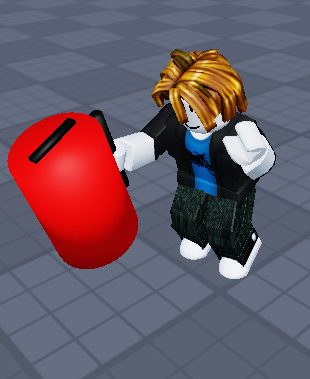

# Roblox 消火器プロジェクト バックログ

## 2026/5/14のタスク
- [x] Roblox Studioで消火器モデルをインポート
- [x] Roblox Assistantを使って、パーツ群を `Handle` へ一括Weld（溶接）
- [x] Toolオブジェクト化して、アバターが手に持てるかテストプレイで確認

## 2026/5/16のタスク
- [x] Blender Pythonスクリプトで消火器モデルを自動生成（タンク・レバー・ホース・圧力計）
- [x] マテリアルキャッシュ破棄＋赤/黒/銀/黄マテリアルの新規作成・割当
- [x] ホースをレバー反対側へ、圧力ゲージを横配置へ位置調整
- [x] `auto_uv_palette_mapping.py` で256色パレットへのUV自動配置
- [x] 生成スクリプトを `assets/blender/scripts/fire_extingisher/` に整理
- [x] `docs/roblox_manual.md` に Blender→FBX エクスポート手順を追記・全体統合
- [x] `palette_256.png` で4色パレットテクスチャを作成
- [x] `fire_extingisher.blend` / `.fbx` を `assets/models/` にエクスポート

## 2026/5/19のタスク

### ドキュメント（`docs/roblox_manual.md`）
- [x] Roblox Studio での Tool 化手順（Bセクション）を追加
- [x] Blender スマートUV投影手順（A-2）を追加
- [x] `auto_uv_palette_mapping.py` の実行手順・汎用性の補足（A-3）を追加
- [x] 完成 Tool の複製・Toolbox 保存手順（Dセクション）を追加
- [x] MeshPart を腰アクセサリー（Accessory）に変換する手順（Eセクション）を追加
- [x] マニュアルを A〜E のフェーズ表構成に整理（Tool 化 / 詳細仕様 / 保管 / アクセサリー化）
- [x] パレットUVの色指定ロジック（マテリアル名 → `COLOR_MAPPING` → UV座標）を調査・整理
- [x] スマートUV手順のスクリーンショットをマニュアルに掲載

## 2026/5/20のタスク

### Rojo × Cursor 開発環境
- [x] `default.project.json` で Client / Server / Shared の 3 層同期を定義
- [x] `docs/cursor_Roblox_Rojo_manual.md` に環境構築手順を作成
- [x] Rojo 連携を検証（Studio へコード同期の動作確認）
- [x] `src/Server/init.server.lua` に救助ゲーム用の初期スポーンスクリプト（消防車ボタン）を追加
- [x] `src/Shared/Config.lua` で共通設定モジュールの読み込みを確
