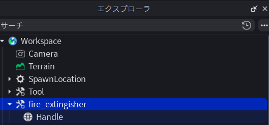

# 🚒 Roblox モデル制作・配置マニュアル

Blender から Roblox Studio へモデルを移行し、**手に持つ Tool** または **腰に装着する Accessory** として使える状態にするまでの手順と仕様です。

| フェーズ | 内容 |
|----------|------|
| **A. Blender** | スマートUV → パレット UV 自動配置 → FBX エクスポート |
| **B. Studio：Tool 化** | インポートした FBX を装備品（Tool）としてセットアップ |
| **C. Studio：詳細調整** | 階層ルール・Weld・グリップ位置の詳細仕様 |
| **D. Studio：Tool の保管** | 完成 Tool の複製・Toolbox への保存（他ゲームでも使い回し） |
| **E. Studio：アクセサリー化** | MeshPart を腰アクセサリー（Accessory）に変換・スポーン装着 |

---

# 📦 A. Blender：UV 展開（パレット前）と FBX エクスポート

**〜 スマートUV・パレット UV 自動配置・Roblox 向け FBX 出力 〜**

## A-1. 概要

Blender から Roblox Studio へモデルを移行するまでの標準フローです。

1. **メッシュ結合**（手動）— パーツを 1 オブジェクトにまとめる
2. **A-2** — スマートUV投影（UV 展開）
3. **A-3** — `auto_uv_palette_mapping.py` でパレット UV を自動配置
4. **A-4 / A-5** — FBX エクスポート（不要データの除外・スケール調整）

エクスポート時は、ライトやカメラを巻き込まず、Roblox の世界観に合ったサイズ（スケール）で出力します。

---

## A-2. カラーパレット用の下準備：スマートUV投影（UV 展開）

メッシュを結合したあと、カラーパレット用のスクリプトを適用するために、モデルの展開図（UV）を自動生成する手順です。

---

### A-2-1. 編集モード（Edit Mode）に切り替える

1. 3D ビューポート上で、結合済みの消火器オブジェクト（`Tank_Body` など）を選択します。
2. **`Tab` キー** を押して、オブジェクトモードから **「編集モード」** に切り替えます。

---

### A-2-2. すべての面を選択する

1. **`A` キー** を押します。
2. 消火器のメッシュ全体（すべての頂点・辺・面）がオレンジ色にハイライトされた状態にします。

---

### A-2-3. スマートUV投影を実行する

1. **`U` キー** を押して「UV マッピング（UV Mapping）」メニューを表示します。
2. メニューの中から **「スマートUV投影（Smart UV Project）」** を選択します。

---

### A-2-4. オプション設定の確認と確定

1. 画面に「スマートUV投影」のプロパティポップアップが表示されます。
2. 基本的には初期設定のままで問題ありません。以下の設定になっていることを確認します。
   - **角度制限（Angle Limit）:** `66°`（デフォルト）
   - **アイランドの余白（Island Margin）:** `0.000`（パレット配置スクリプトでは面を 1 点に集約するため、`0` で問題ありません）
3. **「展開（OK）」** ボタンをクリックします。


---

### A-2-5. 次のステップ

スマートUV投影が完了したら、次の **A-3（自動色塗りスクリプト）** に進んでください。編集モードのままでもオブジェクトモードに戻してから実行しても構いません。

---

## A-3. カラーパレット UV 自動配置：`auto_uv_palette_mapping.py`

結合済みメッシュの各面に付いた **マテリアル名** をもとに、UV を `palette_256.png` 上の対応色の位置へ一括移動するスクリプトです。Roblox 側でパレットテクスチャを貼ったとき、部品ごとに正しい色が出るようにします。

**スクリプトの場所:** `assets/blender/scripts/fire_extingisher/auto_uv_palette_mapping.py`

---

### A-3-0. 実行前の前提条件

以下を満たしていることを確認してから実行してください。

| 項目 | 内容 |
|------|------|
| メッシュ | パーツを **1 つのメッシュに結合済み**（`Ctrl + J`） |
| UV | **A-2 のスマートUV投影** を完了済み |
| マテリアル | 面ごとに `Red` / `Black` / `Silver` / `Yellow` のいずれかが割り当て済み |
| 選択 | 対象の **結合メッシュをアクティブオブジェクト** にしている（他オブジェクトは選択解除推奨） |

> `generate_fire_extinguisher.py` で生成したあと結合した場合、各部品に付いたマテリアル名がそのまま面に残るため、そのまま実行できます。

---

### A-3-1. スクリプトの仕組み（部品ごとの色の決まり方）

スクリプトは **オブジェクト名（`Tank_Body` など）ではなく、面に割り当てられたマテリアル名** だけを見ます。

```text
面 (face)
  → face.material_index（マテリアルスロット番号）
  → マテリアル名（例: "Red"）
  → COLOR_MAPPING["Red"] → UV (0.25, 0.75)
  → その面の全ループの UV を同じ 1 点へ移動
```

`COLOR_MAPPING` で定義した 4 色は、`palette_256.png` 上の **2×2 配置** を前提としています。

```text
パレット UV 空間 (0〜1)
┌─────────┬─────────┐
│  Red    │  Black  │  Y = 0.75
│ (0.25,  │ (0.75,  │
│  0.75)  │  0.75)  │
├─────────┼─────────┤
│ Silver  │ Yellow  │  Y = 0.25
│ (0.25,  │ (0.75,  │
│  0.25)  │  0.25)  │
└─────────┴─────────┘
```

A-2 でスマートUV投影したあと、各面の UV を **1 点に集約** してパレットの色を読む、という流れです。

---

### A-3-2. 汎用性について（他モデルで使う場合）

| 観点 | 説明 |
|------|------|
| **汎用な部分** | 任意のメッシュ 1 つに対し、面のマテリアル名 → UV 座標、という処理。部品名やメッシュ構造には依存しません。 |
| **固定されている部分** | `COLOR_MAPPING` が **Red / Black / Silver / Yellow の 4 色のみ**。UV 座標も上記 2×2 レイアウトでハードコードされています。 |
| **他モデルで使うとき** | 面に付けるマテリアル名を `COLOR_MAPPING` のキーと一致させるか、スクリプト先頭の `COLOR_MAPPING` と `palette_256.png` の色配置を合わせて書き換えてください。 |
| **注意** | 定義にないマテリアル名の面は **スキップ** されます。アクティブオブジェクト **1 つだけ** が対象です。 |

---

### A-3-3. Blender での実行手順

1. 3D ビューポートで、結合済みの消火器メッシュを **左クリックで選択**（アクティブにする）します。
2. 画面上部のワークスペース切り替えから **「Scripting（スクリプト）」** を開くか、エディタを **テキストエディター** に切り替えます。
3. メニュー **「テキスト」➔ 「開く」** から、次のファイルを開きます。
   - `assets/blender/scripts/fire_extingisher/auto_uv_palette_mapping.py`
4. テキストエディター上部の **「スクリプトを実行」** ボタン（▶）をクリックするか、**`Alt + P`** を押して実行します。
5. 画面左下の **「システムコンソール」**（Windows: `ウィンドウ` ➔ `システムコンソールの切り替え`）に、次のメッセージが出れば成功です。
   - `✨ UVの自動パレット配置が完了しました！`
6. オブジェクトモードに自動で戻ります。**UV エディター** で面ごとに UV がパレットの 4 隅付近の 1 点に集まっていることを確認してください。

> **エラーになる場合:** `エラー: メッシュオブジェクトを選択してください。` と出たら、メッシュ以外（カメラ・ライト等）がアクティブになっていないか確認し、結合済みメッシュを再選択してから実行し直してください。

---

### A-3-4. 次のステップ

パレット UV の配置が完了したら、**A-4（FBX エクスポート）** に進んで `.fbx` を出力してください。Roblox Studio 側では `palette_256.png` をテクスチャとして適用します。

---

## A-4. エクスポート時の3大必須チェックポイント

Blender から `.fbx` を出力する際は、必ず `ファイル` ➔ `エクスポート` ➔ `FBX (.fbx)` を選択し、画面右側に表示される **「FBX エクスポート設定パネル」** を以下のように調整します。

### 1. 「選択したオブジェクト（Selected Objects）」にチェックを入れる

- **設定方法**: パネル最上部にある **「選択したオブジェクト」** のチェックボックスを必ずオンにします。
- **理由**:
  Blender のシーン内（コレクション）には、作成したメッシュ以外に「ライト（光）」や「カメラ」が配置されています。これらにチェックを入れないと、シーン内のすべてのデータが 1 つの FBX に同梱されてしまい、Roblox インポート時にエラーや不要なアセットの大量生成を招きます。
- **手順**:
  1. 3D ビューポート上で、出力したい消火器モデル（結合済みメッシュ）を **すべて選択**（全選択）する。
  2. エクスポート画面を開き、「選択したオブジェクト」をオンにして出力する。

### 2. 「オブジェクトタイプ（Object Types）」の絞り込み

- **設定方法**: 「選択したオブジェクト」の下にあるアイコン群（Mesh, Armature, Camera など）から、**`メッシュ（Mesh）` のみをアクティブ**（青色）にします。
- **理由**:
  万が一、全選択時にライトやカメラを誤って巻き込んで選択してしまっていても、ここで「メッシュのみ」に絞り込んでおくことで、形状データだけを確実に抽出するセーフティネットになります。

### 3. スケール適用（Transform Scale）の調整

- **設定方法**: 「トランスフォーム」項目内の **「スケールを適用」** の設定をデフォルトの「オールローカル」から **「FBX オール（FBX All）」** に変更するか、スケール値を Roblox の規格（0.01 倍、または手動調整値）に合わせます。
- **理由**:
  Blender の「1 メートル」と Roblox Studio の「1 スタッド（Stud）」はサイズ基準が異なります。Blender でジャストサイズで作ったつもりでも、そのまま持っていくと Roblox 側で巨大化（または極小化）することがあります。
- **ベストプラクティス**:
  基本は Blender 側で `Ctrl + A` ➔ 「全トランスフォーム」を実行してスケールを `1.0` に固定した上で、エクスポートパネル側で Roblox 用のスケールにチューニングして出力するのが最もサイズが安定します。

---

## A-5. エクスポート画面の「黄金設定」プリセット

迷ったら、右側の設定パネルを以下の状態に固定してください。

```text
【一般（Include）】
☑ 選択したオブジェクト (Selected Objects)
［オブジェクトタイプ］： 🔵 メッシュ (Mesh) のみを有効化

【トランスフォーム（Transform）】
スケール (Scale): 1.0 （または環境に合わせた調整値）
パスモード (Path Mode): 自動 (Auto)
☑ 限定ボーン (Only Deform Bones) ※将来アニメーションを作る場合

【ジオメトリ（Geometry）】
スムージング (Smoothing): 面 (Face) または 法線 (Normals)
☑ UV座標 (UV Coords)
```

---

# 🛠️ B. Roblox Studio：インポートしたモデルの Tool（装備品）化

手動でインポートした 3D モデル（`.fbx`）を、プレイヤーが手に持って使用できる **Tool** としてセットアップする手順です。

---

## B-1. Tool オブジェクトの作成と配置

1. Roblox Studio の右側にある **「Explorer（エクスプローラー）」** パネルを開きます。
2. **`Workspace`** の横にあるプラスボタン（➕）をクリックします。
3. 検索欄に `Tool` と入力し、表示された **Tool** オブジェクトを追加します。
4. 追加された Tool の名前を、分かりやすく `FireExtinguisher` に変更します。

---

## B-2. モデルの格納と「Handle」の設定

Roblox のシステムに「このパーツを手に握らせる」と認識させるための最重要設定です。

1. インポートした消火器のメッシュオブジェクトを、ドラッグ＆ドロップで作成した **`FireExtinguisher`（Tool）の中** に移動させます。
2. 移動させたメッシュオブジェクトの名前を、完全に一致する英文字で **`Handle`**（H は大文字）に変更します。



> ⚠️ **注意点（パーツが複数に分かれている場合）**
> Blender からバラバラのパーツのままインポートした場合は、一番中心となるタンク本体を `Handle` にリネームし、他のレバーやホースなどの子パーツをすべて `Handle` の中にドラッグ＆ドロップして入れます。その上で、パーツ同士がバラバラに吹き飛んでいかないよう、`WeldConstraint`（溶接拘束）等で結合する必要があります。
> ※ 1 つのメッシュに結合してエクスポートしている場合は、そのメッシュを `Handle` にするだけで完了です。

---

## B-3. 持ち位置と向きの調整（Tool Grip Editor）

初期状態では、アバターが消火器のど真ん中を握ってしまったり、向きが不自然（横向きや逆さ）になったりします。プラグインを使って視覚的に調整します。

1. Studio の上部メニューから **「Plugins（プラグイン）」** タブを開きます。
2. **「Tool Grip Editor」**（Roblox 公式の無料プラグイン）を選択して有効化します。
3. エクスプローラー上で **`FireExtinguisher`（Tool）** を選択します。
4. 画面上にダミーのアバターの手と消火器が表示されるので、プラグインのギズモ（矢印や回転リング）を使って、**「持ち手の位置」と「消火器の向き」** を微調整します。

---

## B-4. テストプレイでの確認（StarterPack への配置）

ゲーム開始時にプレイヤーのインベントリへ自動配布されるように設定します。

1. 完成した `FireExtinguisher`（Tool）を、エクスプローラー下の **`StarterPack`** フォルダの中にドラッグ＆ドロップで移動します。
2. 画面上部の **「Play（プレイ）」** ボタンを押してゲームを開始します。
3. 画面下部のホットバー（ショートカット枠）に「FireExtinguisher」が表示されるので、クリックするかキーボードの `1` キーを押して、アバターが正しく手に装備できればセットアップは完了です。

> 階層の詳細ルールや、複数パーツ時の Weld・手動グリップ調整は **セクション C** を参照してください。テクスチャ・スクリプトまで含めた完成 Tool の複製・保管は **セクション D** を参照してください。

---

# 🔧 C. Roblox Studio：装備の詳細仕様（階層・Grip）

Blender からインポートした複数パーツのモデルを、バラバラにせず、アバターの正しい位置・向き（ベクトル）で装備させるための補足仕様です。

---

## C-1. エクスプローラーの階層構造（最重要ルール）

Roblox のシステムが「装備品（Tool）」として認識するためには、インターフェースの規格（階層構造）を完全に合わせる必要があります。
※ Model オブジェクト（青とピンクの積み木アイコン）が挟まっていると、アバターはツールを握ることができず、足元に倒れてしまいます。

### ❌ 失敗する構造（持てずに倒れる）

```text
Workspace
 └── 🛠️ Tool
      └── 🟦 fireestinguisher_notjoin3 (Model)  <-- これが挟まっているとダメ
           ├── ⚪ Handle (パーツ)
           ├── ⚪ Hose_Black
           └── ⚪ Lever_Black
```

### ⭕ 正しい構造（持てる状態）

```text
Workspace
 └── 🛠️ Tool
      ├── ⚪ Handle (★必ず Tool の直下・1階層目に置く)
      ├── ⚪ Hose_Black
      └── ⚪ Lever_Black
```

---

## C-2. 実装・調整の3ステップ

### Step 1：主軸パーツの名前変更と Weld（溶接）

1. インポートしたパーツ群の中から、基準にしたいパーツ（本体やグリップなど）の名前を **`Handle`** に変更する。
2. Roblox Assistant（AI）等のスクリプトを使い、`Handle` を主軸（親）にして、他のすべてのパーツ（Hose や Lever など）を `WeldConstraint` で結合する。
   - ※これにより、ゲーム実行時にパーツがバラバラに崩れ落ちるのを防ぎます。

### Step 2：Tool オブジェクトへの移行

1. Workspace に `Tool` オブジェクトを新規作成する。
2. 上記の【正しい構造】の通り、`Handle` を含むすべてのパーツを `Tool` の直下にドラッグ＆ドロップで移動する（空になった Model は削除する）。

---

## C-3. 持つ場所と向き（ベクトル）の調整仕様

アバターが `Handle` を掴む位置や、持ったときのオブジェクトの傾き（ベクトル）がイマイチな場合は、**「アタッチメント（位置・方向の基準点）」** を使って制御します。

### 💡 仕組み（RightGripAttachment）

Roblox は、アバターの右手にある基準点（Attachment）と、Tool 直下の `Handle` 内にある **`RightGripAttachment`** という名前のアタッチメントの位置・向きを完全に一致（テレポート）させる仕様になっています。
つまり、**「アタッチメントを動かすと、相対的にアバターが握る位置と向きが変わる」** というベクトル計算のロジックです。

### 🛠️ 調整手順

#### 方法A：プラグイン「GripEdit」を使う（推奨・直感的）

1. Marketplace から信頼性の高い公式クローン **`stravant - GripEdit`**（無料）をインストールする。
2. エクスプローラーで調整したい `Tool` を選択する。
3. プラグインのボタンを押すと画面にアバターとオブジェクトの 3D プレビューが表示されるので、移動・回転ツールを使ってマウス操作で直感的に位置とベクトルを微調整する。

#### 方法B：手動でアタッチメントを配置する（力技）

1. `Handle` パーツの直下に、新規アタッチメントを作成し、名前を **`RightGripAttachment`** に変更する。
2. このアタッチメントを選択した状態で、Studio の移動（Move）や回転（Rotate）ツールを使い、消火器の「ちょうど右手で握らせたい位置・角度」へと矢印を動かして調整する。

---

# 📂 D. Roblox Studio：完成 Tool の使い回し・保管

テクスチャ適用、`Handle` 設定、スクリプト作成などがすべて完了した **完全版の Tool** を、設定を失わずに複製・保管する手順です。

---

## D-1. 方法A：エクスプローラー上で複製（現在のゲーム内）

同じゲーム（プロジェクト）のマップ内に、もう 1 個同じ消火器 Tool を配置したい場合は、エクスプローラー上で完結させるのが最速です。

1. Explorer パネルで、セットアップ済みの Tool（`FireExtinguisher`）を選択します。
2. キーボードの **`Ctrl + D`** を押して複製します。
3. 複製された Tool を、そのまま **`Workspace`（マップ上）** の好きな場所に移動します。

これだけで、テクスチャも中身のスクリプトもすべて維持された消火器がマップに配置されます。プレイヤーが近づいて触れれば、そのまま拾って装備できます。

---

## D-2. 方法B：Toolbox（ツールボックス）に保存（他のゲームでも使い回す）

今回作った消火器を、別の新しいゲーム開発でも使い回したい場合は、Roblox の個人アセット（クラウド）に Tool ごと保存します。

1. Explorer パネルで、完成した Tool（`FireExtinguisher`）を右クリックします。
2. メニューから **「Save to Roblox...（Roblox に保存）」** を選択します。
3. 登録画面が出るので、以下を入力して **「Submit（送信）」** を押します。
   - **Asset Type:** `Model`
   - **Name:** `FireExtinguisher_Complete`（分かりやすい名前）
4. 保存が完了すると、画面左側の **「Toolbox（ツールボックス）」** パネル ➔ **「Inventory（マイインベントリ）」タブ**（四角い箱のアイコン）の中に、完全版消火器が保存されます。
5. 今後は、どのゲームを開いていても、この Toolbox からワンクリックで、色付き・スクリプト付きの消火器を現在の場所に追加できます。

---

# 🧯 E. Roblox Studio：3D モデルをアバターアクセサリー（腰装着）に変換

Blender からインポートした MeshPart を、Roblox のシステムが正式に認識する **腰アクセサリー（Accessory）** に変換する手順です。手に持って使う **Tool（セクション B）** とは別の装備方法です。

---

## E-1. 目指すエクスプローラー構造（ゴール）

アクセサリー化が成功すると、エクスプローラー内は Roblox のシステム規格に準拠した以下の親子関係になります。UGC（アバター衣装）の申請や、ゲーム内での自動装着を正常に機能させるための必須構造です。

```text
[任意の名前] (Accessory)            ← 一番外側の入れ物（名前変更 OK）
 └── Handle (MeshPart)              ← ※名前は必ず「Handle」に固定（大文字小文字注意）
      └── WaistBackAttachment (Attachment)  ← 腰の後ろにくっつけるための結合ピン
```

---

## E-2. Accessory Fitting Tool（フィッティングツール）を使った自動変換

Roblox Studio に標準搭載されている公式のフィッティングツールを使うと、視覚的にアバターの見た目を確認しながら、一瞬で正しいデータ構造に変換できます。

### E-2-1. ツールの起動

1. Studio の上部メニューから **「アバター（Avatar）」** タブをクリックします。
2. ツールバーにある **「アクセサリのフィッティング（Accessory Fitting Tool）」**（帽子とメガネのアイコン）をクリックします。

### E-2-2. 対象モデルと装着部位の指定

1. パネルが開いたら、`Part` の選択欄をクリックし、エクスプローラー上（またはマップ上）にある **自作の消火器（MeshPart）** を選択します。
2. `Asset Type`（アイテムの種類）のドロップダウンメニューから **`Waist`（腰）** を選択します。
3. 下部にある **「次へ（Next）」** を押すと、3D 画面上にテスト用のダミー人形が出現し、消火器が自動的に腰の位置に配置されます。

### E-2-3. 位置と角度の微調整

初期状態では、消火器がアバターの体内に埋まったり、向きが傾いていることがほとんどです。

1. Studio のいつもの **「移動（Move）」** や **「回転（Rotate）」** ツールを使い、ダミー人形の腰を見ながら、消火器が「ベルトの右後ろ側」や「背中寄りの腰」など、リアルに見えるベストな位置にくるよう微調整します。

### E-2-4. アクセサリーの自動生成

1. 納得のいく位置に配置できたら、ツール下部にある **「アクセサリを生成（Generate Accessory）」** ボタンをクリックします。
2. エクスプローラーの `Workspace` の直下に、上記の正しい階層構造を持った新品の **Accessory オブジェクト** が自動的に作成されます。

> **注意（エンジニアチェックポイント）**
> 自動生成された一番外側の `Accessory` の名前は、わかりやすく `FireExtinguisherAccessory` などに自由に変更して問題ありません。ただし、その内側にある MeshPart の名前だけは、システムが認識できなくなるため **絶対に `Handle` から変更しないでください。**

---

## E-3. 自分のゲーム内で「完全無料」で装着して遊ぶ設定

UGC としてストアに有料公開（Robux を消費）する前に、自分専用のゲーム内で、最初からこの消火器を腰に身に着けて出現（スポーン）させる設定方法です。

1. 先ほど生成された **`FireExtinguisherAccessory`**（一番親の階層）をマウスで掴みます。
2. エクスプローラー内を下にスクロールし、**`StarterPlayer`** の中にある **`StarterCharacterScripts`** フォルダの直下にドラッグ＆ドロップで入れます。

### E-3-1. テストプレイ

この状態でパブリッシュし、PC やタブレットからゲームを開始してみてください。
ゲームが始まった瞬間に、アバターの腰の後ろに、**自作の消火器が装備された状態**で出現します。
